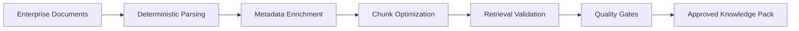
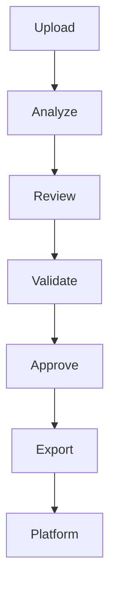

# Chapter 02 — What is RAGDocForge?

> **RAGDocForge Enterprise Documentation**

---

# Executive Summary

**RAGDocForge** is an **enterprise document engineering platform** that transforms unstructured business and technical documentation into governed, retrieval-ready knowledge packs for Retrieval-Augmented Generation (RAG) systems.

It serves as the preparation layer between enterprise content and AI applications, ensuring that only validated, structured, and policy-compliant knowledge reaches production AI agents.

---

# The Problem

Most enterprise documentation was never designed for Large Language Models (LLMs).

Typical enterprise documents often contain:

- Mixed formatting
- Duplicated content
- Weak or missing metadata
- Missing business context
- Embedded SQL and source code
- Inconsistent terminology
- Large sections unsuitable for semantic retrieval

Without proper preparation, these issues reduce retrieval quality, lower answer accuracy, and increase the likelihood of AI hallucinations.

---

# The RAGDocForge Solution

Instead of sending raw documents directly into an embedding model or vector database, RAGDocForge introduces a governed preparation pipeline.



---

# Position in the Enterprise AI Stack

```text
Enterprise Documentation
          │
          ▼
     RAGDocForge
          │
          ▼
 Approved Knowledge Packs
          │
          ▼
 ERP Agentic Platform
          │
          ▼
 Vector Store + AI Agents
```

RAGDocForge is **not**:

- A chatbot
- A vector database
- An orchestration engine
- An ERP runtime

Its responsibility is to prepare trusted, governed knowledge assets for downstream AI systems.

---

# Core Responsibilities

| Responsibility | Purpose |
|---------------|---------|
| **Deterministic Parsing** | Normalize source documents into structured content |
| **Metadata Extraction** | Capture ERP and domain-specific metadata |
| **SQL & PL/SQL Intelligence** | Detect, classify, and enrich database artifacts |
| **Chunk Generation** | Produce retrieval-optimized semantic chunks |
| **Retrieval QA** | Measure and validate retrieval effectiveness |
| **Quality Gates** | Enforce production governance policies |
| **Knowledge Pack Export** | Generate standardized deployment artifacts |

---

# Key Design Principles

## Deterministic First

Core processing does **not** depend on an LLM. Identical inputs should always produce identical outputs.

---

## LLM as an Advisor

When enabled, LLMs provide recommendations rather than authoritative results. Human review and deterministic analysis remain the source of truth.

---

## Governance by Default

Every exported knowledge pack should be:

- Reviewable
- Traceable
- Reproducible
- Policy compliant

---

# Knowledge Pack Lifecycle



---

# Intended Users

RAGDocForge is designed for:

- Enterprise AI Architects
- Oracle EBS Support Engineers
- Knowledge Engineers
- Technical Writers
- DevOps Teams
- Platform Engineers

---

# Typical Use Cases

## Oracle EBS Knowledge Engineering

Convert implementation guides, troubleshooting manuals, SQL scripts, and operational procedures into governed knowledge packs optimized for enterprise AI.

---

## Enterprise Support

Prepare validated documentation for AI-powered support assistants and engineering copilots.

---

## Agentic AI Platforms

Provide trusted knowledge assets to multi-agent orchestration systems and enterprise reasoning platforms.

---

# What RAGDocForge Does **Not** Do

RAGDocForge intentionally does **not**:

- Execute ERP transactions
- Modify production databases
- Replace vector databases
- Replace AI orchestration frameworks
- Serve as an end-user chatbot

Its responsibility ends with producing high-quality, validated, deployment-ready knowledge assets.

---

# Business Value

Organizations adopting RAGDocForge benefit from:

- Higher retrieval precision
- Reduced hallucination risk
- Standardized knowledge preparation
- Repeatable release processes
- Auditable AI governance
- Improved enterprise knowledge quality

---

# Chapter Summary

RAGDocForge transforms enterprise documentation into trusted AI knowledge through deterministic processing, governance, validation, and quality assurance.

It provides the missing preparation layer between raw enterprise documentation and production-grade AI systems.

---

# Next Chapter

➡️ **[Chapter 03 — Why RAGDocForge?](03-Why-RAGDocForge-Documentation.md)**

The next chapter explores the limitations of traditional RAG pipelines, enterprise governance requirements, and the architectural motivations that led to the design of RAGDocForge.

---