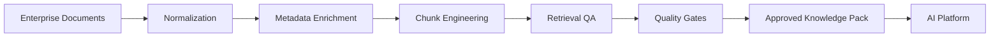

# Chapter 03 — Why RAGDocForge?

> **RAGDocForge Enterprise Documentation**

---

# Executive Summary

Modern Retrieval-Augmented Generation (RAG) systems often struggle because they rely on **raw enterprise documentation** that was never authored or structured for AI retrieval.

RAGDocForge addresses this challenge by introducing a governed knowledge engineering pipeline that transforms enterprise documents into validated, retrieval-optimized knowledge packs before they are deployed into AI platforms.

---

# The Challenge with Traditional RAG

A conventional RAG pipeline is often simplified as:

```text
Documents
    │
    ▼
Chunking
    │
    ▼
Embeddings
    │
    ▼
Vector Database
    │
    ▼
Large Language Model
```

Although straightforward, this approach assumes the source documentation is already suitable for semantic retrieval. In enterprise environments, that assumption is rarely valid.

---

# Common Enterprise Pain Points

| Problem | Impact |
|---------|--------|
| **Inconsistent Formatting** | Poor chunk boundaries and fragmented retrieval |
| **Duplicate Procedures** | Conflicting retrieval results |
| **Missing Metadata** | Weak filtering and ranking |
| **Embedded SQL & Code** | Unsafe or incomplete AI responses |
| **Mixed Document Quality** | Hallucinations and irrelevant context |
| **Lack of Governance** | Difficult audits, approvals, and compliance |

---

# The RAGDocForge Approach

Instead of embedding documents immediately, RAGDocForge inserts an engineering and governance layer into the knowledge preparation process.



This architecture clearly separates **knowledge preparation** from **knowledge consumption**, allowing enterprise AI systems to operate on curated, trusted knowledge instead of raw documentation.

---

# Why Governance Matters

Enterprise AI systems frequently answer questions related to:

- Finance
- Operations
- Oracle ERP Support
- Compliance
- Production troubleshooting

Incorrect or unsupported answers can have significant operational consequences.

RAGDocForge introduces governance through:

- Deterministic document processing
- Human review and approval
- Quality scoring
- SQL and PL/SQL safety analysis
- Retrieval validation
- Approval workflows
- Baseline regression testing

---

# Traditional RAG vs. RAGDocForge

| Capability | Traditional Pipeline | RAGDocForge |
|------------|:--------------------:|:-----------:|
| Intelligent Parsing | ❌ | ✅ |
| ERP-Aware Metadata | ❌ | ✅ |
| SQL & PL/SQL Intelligence | ❌ | ✅ |
| Retrieval Simulation | ❌ | ✅ |
| Quality Policies | ❌ | ✅ |
| Human Review Workflow | ❌ | ✅ |
| Release-Ready Knowledge Packs | ❌ | ✅ |

---

# Business Benefits

## Higher Retrieval Accuracy

Well-structured semantic chunks and enriched metadata significantly improve retrieval relevance and precision.

---

## Lower Hallucination Risk

Quality gates identify and remove low-confidence, incomplete, or unsupported content before deployment.

---

## Repeatable Releases

Knowledge packs become version-controlled, reviewable release artifacts rather than ad hoc document exports.

---

## Enterprise Trust

Every stage of the preparation pipeline is:

- Explainable
- Traceable
- Auditable
- Suitable for regulated enterprise environments

---

# Architectural Philosophy

RAGDocForge follows one fundamental principle:

> **Do the engineering work before the AI starts reasoning.**

Rather than expecting an LLM to compensate for poor-quality documentation, improve the quality of the knowledge itself before it reaches the AI platform.

---

# Where RAGDocForge Fits

```text
Raw Enterprise Content
        │
        ▼
   RAGDocForge
        │
        ▼
 Approved Knowledge Packs
        │
        ▼
 ERP Agentic Platform
        │
        ▼
 Vector Store
        │
        ▼
 Intelligent AI Agents
```

RAGDocForge serves as the governed knowledge preparation layer that bridges enterprise documentation and production AI systems.

---

# Key Takeaways

- High-quality RAG depends on high-quality knowledge.
- Governance should occur **before** AI deployment.
- Deterministic processing improves repeatability and consistency.
- AI platforms perform best when supplied with curated, validated knowledge rather than raw enterprise documents.

---

# Chapter Summary

Traditional RAG pipelines assume enterprise documentation is immediately suitable for semantic retrieval. In practice, this assumption leads to inconsistent retrieval quality, hallucinations, and governance challenges.

RAGDocForge solves these problems by introducing a deterministic, governed knowledge engineering pipeline that prepares, validates, and optimizes enterprise documentation before it reaches vector databases and AI agents.

---

# Next Chapter

➡️ **[Chapter 04 — Core Capabilities](04-Core-Capabilities-RAGDocForge-Documentation.md)**

Explore every major subsystem within RAGDocForge, including deterministic parsing, metadata enrichment, SQL intelligence, retrieval quality assurance, quality gates, human review workflows, and enterprise platform integration.

---