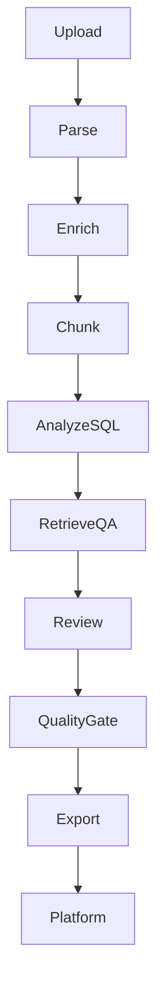

# Chapter 04 — Core Capabilities

> **RAGDocForge Enterprise Documentation**

---

# Executive Summary

RAGDocForge is composed of a collection of cooperating capabilities that transform raw enterprise documentation into governed, production-ready knowledge packs.

Each capability has a clearly defined responsibility and contributes to the overall quality, traceability, and reliability of downstream AI systems.

---

# Capability Map

```mermaid
flowchart LR
    A[Document Ingestion]
        --> B[Deterministic Parsing]
        --> C[Metadata Enrichment]
        --> D[Chunk Engineering]
        --> E[SQL & PL/SQL Intelligence]
        --> F[Retrieval QA]
        --> G[Human Review]
        --> H[Quality Gates]
        --> I[Knowledge Pack Export]
        --> J[ERP Agentic Platform]
```



---

# Capability Overview

| Capability | Primary Goal | Enterprise Benefit |
|------------|--------------|--------------------|
| **Document Ingestion** | Accept supported document types | Consistent input processing |
| **Deterministic Parsing** | Normalize enterprise content | Repeatable and predictable processing |
| **Metadata Enrichment** | Add structured business context | Improved retrieval precision |
| **Chunk Engineering** | Generate semantic retrieval units | Higher answer quality |
| **SQL & PL/SQL Intelligence** | Understand database artifacts | Safer AI-assisted support |
| **Retrieval QA** | Measure retrieval effectiveness | Evidence-based quality assurance |
| **Human Review** | Govern content approval | Enterprise trust and accountability |
| **Quality Gates** | Enforce release policies | Production readiness |
| **Knowledge Pack Export** | Produce deployment artifacts | Standardized platform integration |

---

# 1. Document Ingestion

RAGDocForge accepts a variety of enterprise document formats, including:

- PDF
- DOCX
- Markdown
- TXT
- SQL
- PL/SQL

During ingestion, the platform:

- Validates supported file types
- Captures document metadata
- Prepares content for deterministic parsing

### Key Outcomes

- Consistent document ingestion
- Repeatable processing pipeline
- Unified internal document model

---

# 2. Deterministic Parsing

Deterministic parsing converts heterogeneous enterprise documents into normalized Markdown and structured intermediate representations.

Unlike LLM-driven parsing, deterministic processing guarantees that identical inputs always produce identical outputs.

### Benefits

- Reproducible results
- Stable regression testing
- Easier troubleshooting
- Predictable processing behavior

---

# 3. Metadata Enrichment

Metadata enrichment extracts enterprise-specific information that improves retrieval quality and contextual relevance.

Typical metadata includes:

- Oracle EBS modules
- Business processes
- Database objects
- Error codes
- APIs
- Configuration references

Rich metadata enables more accurate filtering, ranking, and semantic search.

---

# 4. Chunk Engineering

Chunk engineering is far more sophisticated than simply splitting text into fixed-size sections.

RAGDocForge generates coherent retrieval units by preserving:

- Document hierarchy
- Semantic boundaries
- Contextual continuity

### Objectives

- Minimize tiny chunks
- Reduce duplicated content
- Preserve business context
- Improve retrieval recall
- Optimize semantic search performance

---

# 5. SQL & PL/SQL Intelligence

RAGDocForge performs static analysis of SQL and PL/SQL artifacts to identify important database structures without executing any code.

Detected artifacts include:

- Tables
- Views
- Packages
- Procedures
- Functions
- Bind variables
- SQL safety considerations

This capability enables safe AI-assisted Oracle EBS troubleshooting while protecting production systems.

---

# 6. Retrieval Quality Assurance

Retrieval QA evaluates whether generated knowledge chunks can successfully answer representative questions.

Common evaluation metrics include:

| Metric | Purpose |
|--------|---------|
| **Hit@1** | Measures first-result relevance |
| **Hit@3** | Evaluates top-three retrieval accuracy |
| **Hit@5** | Measures broader retrieval quality |
| **Unsupported Answer Risk** | Estimates hallucination risk |
| **Chunk Coverage** | Measures knowledge completeness |

These metrics provide objective evidence of retrieval quality before deployment.

---

# 7. Human Review

Enterprise knowledge should never be published without appropriate governance.

Human reviewers can:

- Approve knowledge packs
- Reject submissions
- Request revisions
- Add review comments
- Validate SQL and PL/SQL findings

This creates a fully auditable approval process suitable for enterprise environments.

---

# 8. Quality Gates

Quality Gates enforce configurable release policies before a knowledge pack can be deployed.

Typical validation checks include:

- Required artifacts
- Quality score thresholds
- Metadata completeness
- Retrieval performance metrics
- Duplicate chunk ratios
- SQL safety validation
- Human review completion

Only knowledge packs that satisfy all configured policies are eligible for release.

---

# 9. Knowledge Pack Export

The final output is a governed knowledge pack containing standardized deployment artifacts for downstream AI platforms.

Typical package contents include:

```text
manifest.json
chunks.jsonl
quality_report.json
metadata_sidecar.json

platform/
retrieval_qa/
review/
quality_gates/
```

These artifacts provide a consistent interface for deployment into enterprise AI platforms.

---

# End-to-End Capability Flow



---

# Design Philosophy

Every capability within RAGDocForge follows the **Single Responsibility Principle**.

Rather than relying on one large AI model to solve every problem, RAGDocForge composes deterministic processing, validation stages, and governance checkpoints into a transparent, modular pipeline.

This architecture provides:

- Better testability
- Easier maintenance
- Greater transparency
- Improved scalability
- Long-term extensibility

---

# Key Takeaways

- Every capability delivers measurable business value.
- Deterministic processing is the foundation of the platform.
- Governance is built into the workflow rather than added afterward.
- Quality is validated before deployment.
- Knowledge packs become governed release artifacts for enterprise AI systems.

---

# Chapter Summary

RAGDocForge combines deterministic engineering, enterprise governance, quality assurance, and structured knowledge packaging into a modular document preparation platform.

Each capability focuses on a single responsibility while contributing to a transparent, auditable pipeline that produces trusted knowledge assets ready for enterprise AI deployment.

---

# Next Chapter

➡️ **[Chapter 05 — Enterprise Usage & Best Practices](05-Enterprise-Usage-Patterns-and-Best-Practices.md)**

The next chapter explores enterprise deployment patterns, recommended operational practices, governance strategies, and architectural guidance for adopting RAGDocForge in production environments.

---